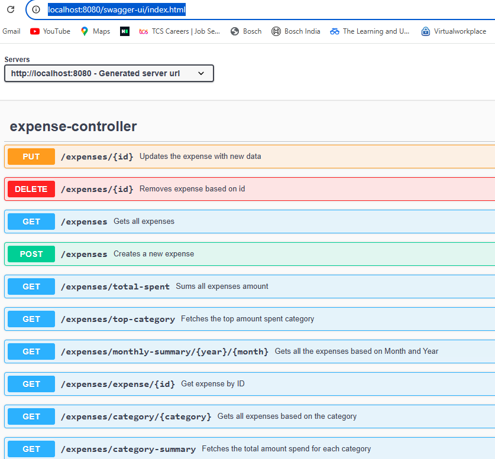
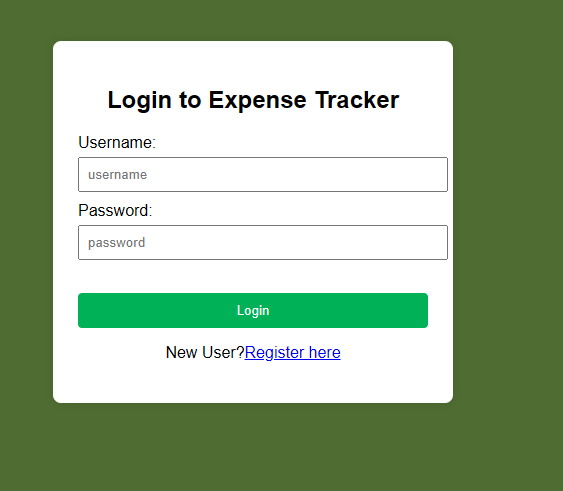
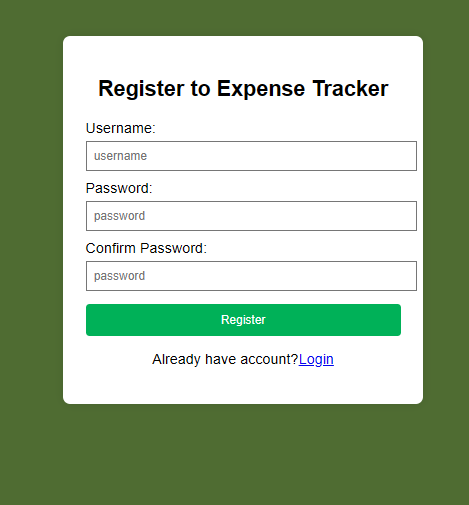
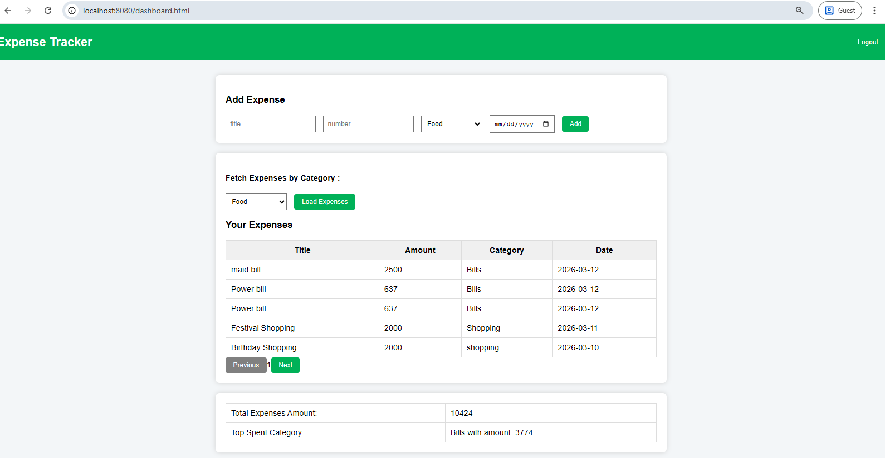

# smart-expense-tracker
This smart expense tracker application built using Spring Boot with JWT authentication and a simple UI dashboard with pagination.

##Features

-User Registration & Login
-JWT Authentication
-Caching Expenses based on user
-Add / Update / Delete Expenses
-Pagination for expenses listing
-Category wise expense 
-Listing top spent category
-Listing total expense amount

Tech Stack

Backend:
- Java
- Spring Boot
- Spring Security
- Spring Data JPA
- JWT Authentication
- REST APIs

Database:
-H2/MySQL

Frontend: 
-HTML
-JavaScript
-CSS

##API Documentaion
Swagger UI
    - available at: http://localhost:8080/swagger-ui/index.html

## Running the Application
mvn clean install
mvn spring-boot:run

Application runs on: http://locahost:8080

##Application Screenshots

### Login page

### Register page

### Dashboard page
